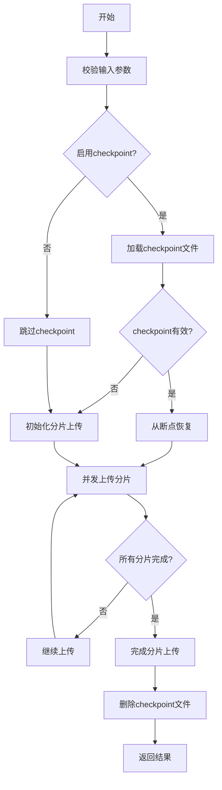
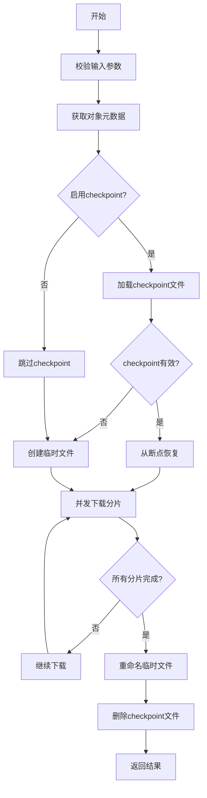
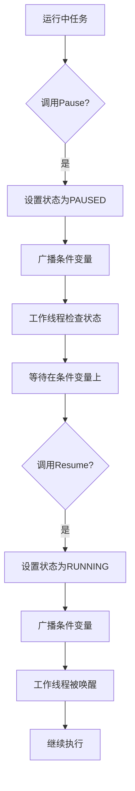
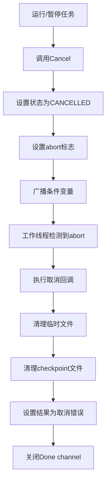

# OBS SDK Go 断点续传功能设计文档

## 1. 概述

### 1.1 功能描述

本设计文档描述了华为云 OBS Go SDK 中的断点续传功能，包括同步和异步两种模式，以及支持暂停、恢复、取消等控制操作的异步任务管理机制。

### 1.2 设计目标

- **可靠性**: 通过checkpoint机制实现断点续传，确保在网络异常或程序崩溃后能够从断点处继续传输
- **可控性**: 提供异步API，支持运行时暂停、恢复、取消传输任务
- **高效性**: 支持分片并发传输，提高大文件传输效率
- **易用性**: 提供简洁的API接口，隐藏复杂实现细节

### 1.3 适用场景

- 大文件上传（>100MB）
- 大文件下载（>100MB）
- 网络不稳定环境下的文件传输
- 需要控制传输进度的场景
- 需要取消或暂停长时间运行的传输任务

## 2. 架构设计

### 2.1 分层架构

```
┌─────────────────────────────────────────────────────────────┐
│                      Client Layer                          │
│  UploadFile(), DownloadFile()                              │
│  UploadFileAsync(), DownloadFileAsync()                    │
└────────────────────┬────────────────────────────────────────┘
                     │
                     ▼
┌─────────────────────────────────────────────────────────────┐
│                    Transfer Layer                          │
│  TransferTask (状态管理、控制接口)                           │
│  - Pause() / Resume() / Cancel()                            │
│  - Status() / Done() / GetResult()                          │
└────────────────────┬────────────────────────────────────────┘
                     │
                     ▼
┌─────────────────────────────────────────────────────────────┐
│                     HTTP Layer                             │
│  doActionWithBucket() / doActionWithObject()                │
│  (签名、重试、错误处理)                                       │
└────────────────────┬────────────────────────────────────────┘
                     │
                     ▼
┌─────────────────────────────────────────────────────────────┐
│                    Model Layer                             │
│  UploadCheckpoint / DownloadCheckpoint                      │
│  UploadPartInfo / DownloadPartInfo                          │
│  (序列化/反序列化)                                           │
└─────────────────────────────────────────────────────────────┘
```

### 2.2 模块职责

| 模块 | 文件 | 职责 |
|------|------|------|
| Client Layer | client_resume.go | 提供公共API，参数校验，配置默认值 |
| Transfer Layer | transfer.go | 异步任务管理，状态机，控制接口 |
| Checkpoint Manager | transfer.go | checkpoint文件读写，有效性验证 |
| Concurrent Executor | transfer.go | 分片并发执行，进度跟踪 |
| HTTP Layer | http.go | 请求签名，发送，响应解析 |

## 3. 核心数据结构

### 3.1 任务状态

```go
// TransferStatusType 定义传输任务的状态类型
type TransferStatusType string

const (
    TransferStatusRunning   TransferStatusType = "RUNNING"   // 运行中
    TransferStatusPaused    TransferStatusType = "PAUSED"    // 已暂停
    TransferStatusCancelled TransferStatusType = "CANCELLED" // 已取消
    TransferStatusCompleted TransferStatusType = "COMPLETED" // 已完成
    TransferStatusFailed    TransferStatusType = "FAILED"    // 已失败
)
```

**状态转换图**：
```
     ┌──────────┐
     │ RUNNING  │◄───────┐
     └────┬─────┘        │
          │              │
    Pause│         Resume│
          ▼              │
     ┌──────────┐        │
     │ PAUSED   │────────┘
     └────┬─────┘
          │
       Cancel│
          ▼
     ┌──────────┐
     │CANCELLED │
     └──────────┘

     (任务自然结束)
          │
          ▼
     ┌──────────┐
     │COMPLETED │
     └──────────┘

     (任务失败)
          │
          ▼
     ┌──────────┐
     │  FAILED  │
     └──────────┘
```

### 3.2 异步任务

```go
// TransferTask 代表一个可控制的异步传输任务
type TransferTask struct {
    mu       sync.Mutex         // 保护并发访问
    cond     *sync.Cond         // 条件变量，用于暂停/恢复
    status   TransferStatusType // 当前状态
    abort    int32              // 原子标志，指示是否应该中止
    done     chan struct{}      // 完成信号通道
    once     sync.Once          // 确保finish只调用一次
    result   interface{}        // 任务结果
    err      error              // 任务错误
    onCancel func()             // 取消时的清理函数
}
```

**核心方法**：

| 方法 | 说明 | 状态要求 |
|------|------|----------|
| `Status() TransferStatusType` | 获取当前状态 | 无 |
| `Pause() error` | 暂停任务 | RUNNING |
| `Resume() error` | 恢复任务 | PAUSED |
| `Cancel() error` | 取消任务 | RUNNING, PAUSED |
| `Done() <-chan struct{}` | 等待完成 | 无 |
| `GetResult() (interface{}, error)` | 获取结果 | 建议在Done()后调用 |

### 3.3 上传Checkpoint

```go
// UploadCheckpoint 上传checkpoint文件结构
type UploadCheckpoint struct {
    XMLName     xml.Name         `xml:"UploadFileCheckpoint"`
    Bucket      string           `xml:"Bucket"`
    Key         string           `xml:"Key"`
    UploadId    string           `xml:"UploadId,omitempty"`
    UploadFile  string           `xml:"FileUrl"`
    FileInfo    FileStatus       `xml:"FileInfo"`
    UploadParts []UploadPartInfo `xml:"UploadParts>UploadPart"`
}

// FileStatus 文件状态信息
type FileStatus struct {
    XMLName      xml.Name `xml:"FileInfo"`
    LastModified int64    `xml:"LastModified"`
    Size         int64    `xml:"Size"`
}

// UploadPartInfo 上传分片信息
type UploadPartInfo struct {
    XMLName     xml.Name `xml:"UploadPart"`
    PartNumber  int      `xml:"PartNumber"`
    Etag        string   `xml:"Etag"`
    PartSize    int64    `xml:"PartSize"`
    Offset      int64    `xml:"Offset"`
    IsCompleted bool     `xml:"IsCompleted"`
}
```

### 3.4 下载Checkpoint

```go
// DownloadCheckpoint 下载checkpoint文件结构
type DownloadCheckpoint struct {
    XMLName       xml.Name           `xml:"DownloadFileCheckpoint"`
    Bucket        string             `xml:"Bucket"`
    Key           string             `xml:"Key"`
    VersionId     string             `xml:"VersionId,omitempty"`
    DownloadFile  string             `xml:"FileUrl"`
    ObjectInfo    ObjectInfo         `xml:"ObjectInfo"`
    TempFileInfo  TempFileInfo       `xml:"TempFileInfo"`
    DownloadParts []DownloadPartInfo `xml:"DownloadParts>DownloadPart"`
}

// ObjectInfo 对象信息
type ObjectInfo struct {
    XMLName      xml.Name `xml:"ObjectInfo"`
    LastModified int64    `xml:"LastModified"`
    Size         int64    `xml:"Size"`
    ETag         string   `xml:"ETag"`
}

// DownloadPartInfo 下载分片信息
type DownloadPartInfo struct {
    XMLName     xml.Name `xml:"DownloadPart"`
    PartNumber  int64    `xml:"PartNumber"`
    RangeEnd    int64    `xml:"RangeEnd"`
    Offset      int64    `xml:"Offset"`
    IsCompleted bool     `xml:"IsCompleted"`
}
```

## 4. API接口设计

### 4.1 同步API

#### UploadFile - 同步断点续传上传

```go
func (obsClient ObsClient) UploadFile(
    input *UploadFileInput,
    extensions ...extensionOptions,
) (output *CompleteMultipartUploadOutput, err error)
```

**参数说明**：
- `input.UploadFile`: 本地文件路径（必填）
- `input.Bucket`: 目标桶名（必填）
- `input.Key`: 对象键（必填）
- `input.PartSize`: 分片大小，默认5MB，范围100KB-5GB
- `input.TaskNum`: 并发任务数，默认1
- `input.EnableCheckpoint`: 是否启用checkpoint，默认false
- `input.CheckpointFile`: checkpoint文件路径，默认`{UploadFile}.uploadfile_record`
- `extensions`: 扩展选项（进度监听、流量限制等）

**返回值**：
- 成功：`CompleteMultipartUploadOutput`，包含ETag、版本ID等
- 失败：错误信息

#### DownloadFile - 同步断点续传下载

```go
func (obsClient ObsClient) DownloadFile(
    input *DownloadFileInput,
    extensions ...extensionOptions,
) (output *GetObjectMetadataOutput, err error)
```

**参数说明**：
- `input.Bucket`: 源桶名（必填）
- `input.Key`: 对象键（必填）
- `input.DownloadFile`: 本地保存路径（必填）
- `input.VersionId`: 对象版本ID（可选）
- `input.PartSize`: 分片大小，默认5MB
- `input.TaskNum`: 并发任务数，默认1
- `input.EnableCheckpoint`: 是否启用checkpoint，默认false
- `input.CheckpointFile`: checkpoint文件路径，默认`{DownloadFile}.downloadfile_record`

### 4.2 异步API

#### UploadFileAsync - 异步断点续传上传

```go
func (obsClient ObsClient) UploadFileAsync(
    input *UploadFileInput,
    extensions ...extensionOptions,
) (task *TransferTask, err error)
```

**返回值**：
- `task.TransferTask`: 异步任务句柄，用于控制任务
  - `task.Status()`: 获取当前状态
  - `task.Pause()`: 暂停任务
  - `task.Resume()`: 恢复任务
  - `task.Cancel()`: 取消任务
  - `task.Done()`: 等待完成的channel
  - `task.GetResult()`: 获取结果（建议在Done()后调用）

#### DownloadFileAsync - 异步断点续传下载

```go
func (obsClient ObsClient) DownloadFileAsync(
    input *DownloadFileInput,
    extensions ...extensionOptions,
) (task *TransferTask, err error)
```

## 5. 实现流程

### 5.1 上传流程



### 5.2 下载流程



### 5.3 暂停/恢复流程



### 5.4 取消流程



## 6. Checkpoint机制

### 6.1 Checkpoint文件结构

**上传Checkpoint文件示例**：
```xml
<?xml version="1.0" encoding="UTF-8"?>
<UploadFileCheckpoint>
    <Bucket>test-bucket</Bucket>
    <Key>large-file.dat</Key>
    <UploadId>0000018D6BF71B2B3FEDD9D8B8E93E4</UploadId>
    <FileUrl>/path/to/large-file.dat</FileUrl>
    <FileInfo>
        <LastModified>1715200000</LastModified>
        <Size>1073741824</Size>
    </FileInfo>
    <UploadParts>
        <UploadPart>
            <PartNumber>1</PartNumber>
            <Etag>"d41d8cd98f00b204e9800998ecf8427e"</Etag>
            <PartSize>5242880</PartSize>
            <Offset>0</Offset>
            <IsCompleted>true</IsCompleted>
        </UploadPart>
        <UploadPart>
            <PartNumber>2</PartNumber>
            <Etag></Etag>
            <PartSize>5242880</PartSize>
            <Offset>5242880</Offset>
            <IsCompleted>false</IsCompleted>
        </UploadPart>
    </UploadParts>
</UploadFileCheckpoint>
```

**下载Checkpoint文件示例**：
```xml
<?xml version="1.0" encoding="UTF-8"?>
<DownloadFileCheckpoint>
    <Bucket>test-bucket</Bucket>
    <Key>large-file.dat</Key>
    <DownloadFile>/path/to/download.dat</DownloadFile>
    <ObjectInfo>
        <LastModified>1715200000</LastModified>
        <Size>1073741824</Size>
        <ETag>"d41d8cd98f00b204e9800998ecf8427e"</ETag>
    </ObjectInfo>
    <TempFileInfo>
        <TempFileUrl>/path/to/download.dat.tmp</TempFileUrl>
        <Size>1073741824</Size>
    </TempFileInfo>
    <DownloadParts>
        <DownloadPart>
            <PartNumber>1</PartNumber>
            <RangeEnd>5242879</RangeEnd>
            <Offset>0</Offset>
            <IsCompleted>true</IsCompleted>
        </DownloadPart>
        <DownloadPart>
            <PartNumber>2</PartNumber>
            <RangeEnd>10485759</RangeEnd>
            <Offset>5242880</Offset>
            <IsCompleted>false</IsCompleted>
        </DownloadPart>
    </DownloadParts>
</DownloadFileCheckpoint>
```

### 6.2 Checkpoint有效性验证

**上传Checkpoint验证**：
```go
func (ufc *UploadCheckpoint) isValid(bucket, key, uploadFile string, fileStat os.FileInfo) bool {
    // 1. 验证桶名、对象键、文件路径是否匹配
    if ufc.Bucket != bucket || ufc.Key != key || ufc.UploadFile != uploadFile {
        return false
    }

    // 2. 验证文件是否被修改
    if ufc.FileInfo.Size != fileStat.Size() ||
       ufc.FileInfo.LastModified != fileStat.ModTime().Unix() {
        return false
    }

    // 3. 验证UploadId是否有效
    if ufc.UploadId == "" {
        return false
    }

    return true
}
```

**下载Checkpoint验证**：
```go
func (dfc *DownloadCheckpoint) isValid(input *DownloadFileInput, output *GetObjectMetadataOutput) bool {
    // 1. 验证桶名、对象键、下载文件路径是否匹配
    if dfc.Bucket != input.Bucket || dfc.Key != input.Key ||
       dfc.VersionId != input.VersionId || dfc.DownloadFile != input.DownloadFile {
        return false
    }

    // 2. 验证对象是否被修改
    if dfc.ObjectInfo.LastModified != output.LastModified.Unix() ||
       dfc.ObjectInfo.ETag != output.ETag ||
       dfc.ObjectInfo.Size != output.ContentLength {
        return false
    }

    // 3. 验证临时文件是否存在且大小正确
    stat, err := os.Stat(dfc.TempFileInfo.TempFileUrl)
    if err != nil || stat.Size() != dfc.ObjectInfo.Size {
        return false
    }

    return true
}
```

### 6.3 Checkpoint更新策略

- **触发时机**：每个分片完成后立即更新
- **更新方式**：原子性覆盖写入
- **失败处理**：更新失败不影响当前分片，记录警告日志

```go
func updateCheckpointFile(fc interface{}, checkpointFilePath string) error {
    result, err := xml.Marshal(fc)
    if err != nil {
        return err
    }
    // 使用临时文件+重命名机制保证原子性
    return ioutil.WriteFile(checkpointFilePath, result, 0640)
}
```

## 7. 并发控制

### 7.1 工作池模式

使用固定大小的工作池控制并发度：

```go
type RoutinePool struct {
    workerNum int
    queue     chan interface{}
    wg        sync.WaitGroup
}

func NewRoutinePool(workerNum, queueSize int) *RoutinePool {
    pool := &RoutinePool{
        workerNum: workerNum,
        queue:     make(chan interface{}, queueSize),
    }

    for i := 0; i < workerNum; i++ {
        pool.wg.Add(1)
        go pool.worker()
    }

    return pool
}

func (p *RoutinePool) worker() {
    defer p.wg.Done()
    for task := range p.queue {
        if fn, ok := task.(func() interface{}); ok {
            fn()
        }
    }
}
```

### 7.2 分片任务调度

**上传分片调度**：
```go
for _, uploadPart := range ufc.UploadParts {
    // 检查暂停状态
    if task != nil {
        if task.checkAndWaitPause() {
            break
        }
    }

    // 检查取消状态
    if atomic.LoadInt32(abortPtr) == 1 {
        break
    }

    // 跳过已完成的分片
    if uploadPart.IsCompleted {
        atomic.AddInt64(&completedBytes, uploadPart.PartSize)
        continue
    }

    // 提交分片任务
    partTask := uploadPartTask{...}
    pool.ExecuteFunc(func() interface{} {
        return partTask.Run()
    })
}
```

### 7.3 线程安全保证

**互斥锁保护的状态访问**：
```go
func (t *TransferTask) Status() TransferStatusType {
    t.mu.Lock()
    defer t.mu.Unlock()
    return t.status
}

func (t *TransferTask) Pause() error {
    t.mu.Lock()
    defer t.mu.Unlock()

    if t.status != TransferStatusRunning {
        return fmt.Errorf("cannot pause task in state %s", t.status)
    }

    t.status = TransferStatusPaused
    t.cond.Broadcast()  // 通知所有等待的线程
    return nil
}
```

**条件变量的暂停/恢复**：
```go
func (t *TransferTask) checkAndWaitPause() bool {
    t.mu.Lock()
    for t.status == TransferStatusPaused {
        t.cond.Wait()  // 释放锁并等待，被唤醒后重新获取锁
    }

    cancelled := t.status == TransferStatusCancelled
    t.mu.Unlock()

    return cancelled
}
```

**原子操作的abort标志**：
```go
func (task *uploadPartTask) Run() interface{} {
    if atomic.LoadInt32(task.abort) == 1 {
        return errAbort
    }

    // 执行上传...

    // 处理4xx错误时中止
    if obsError, ok := err.(ObsError); ok &&
       obsError.StatusCode >= 400 && obsError.StatusCode < 500 {
        atomic.CompareAndSwapInt32(task.abort, 0, 1)
    }

    return result
}
```

## 8. 错误处理

### 8.1 错误分类

| 错误类型 | 处理策略 | 是否可恢复 |
|----------|----------|-----------|
| 网络超时 | 自动重试 | 是 |
| 4xx错误 | 立即中止，记录checkpoint | 否 |
| 5xx错误 | 重试后失败，记录checkpoint | 是 |
| 磁盘满 | 立即中止 | 否 |
| 文件被修改 | 清除checkpoint，重新开始 | 否 |
| 任务取消 | 清理临时资源 | - |

### 8.2 重试策略

```go
// HTTP层已实现的重试配置
type RetryConfig struct {
    MaxRetryCount int           // 最大重试次数
    RetryInterval time.Duration // 重试间隔
    RetryPolicy   RetryPolicy   // 重试策略
}

// 默认配置
const (
    DefaultMaxRetryCount = 3
    DefaultRetryInterval = 100 * time.Millisecond
)
```

### 8.3 清理策略

**上传失败清理**：
```go
func handleUploadFileResult(uploadPartError error, ufc *UploadCheckpoint,
                             enableCheckpoint bool, obsClient *ObsClient,
                             extensions []extensionOptions) error {
    if uploadPartError != nil {
        if enableCheckpoint {
            // 保留checkpoint，支持后续恢复
            return uploadPartError
        }
        // 不启用checkpoint，清理分片上传
        _err := abortTask(ufc.Bucket, ufc.Key, ufc.UploadId, obsClient, extensions)
        if _err != nil {
            doLog(LEVEL_WARN, "Failed to abort task [%s].", ufc.UploadId)
        }
        return uploadPartError
    }
    return nil
}
```

**下载失败清理**：
```go
func handleDownloadFileResult(tempFileURL string, enableCheckpoint bool,
                               downloadFileError error) error {
    if downloadFileError != nil {
        if !enableCheckpoint {
            // 删除临时文件
            _err := os.Remove(tempFileURL)
            if _err != nil {
                doLog(LEVEL_WARN, "Failed to remove temp file: %v", _err)
            }
        }
        return downloadFileError
    }
    return nil
}
```

**任务取消清理**：
```go
func (t *TransferTask) cancelCleanup() {
    if t.onCancel != nil {
        t.onCancel()
    }
}

// 上传任务取消回调
func newUploadTaskOnCancel(ufc *UploadCheckpoint, checkpointFile string,
                           obsClient *ObsClient, extensions []extensionOptions) func() {
    return func() {
        // 中止分片上传
        _err := abortTask(ufc.Bucket, ufc.Key, ufc.UploadId, obsClient, extensions)
        if _err != nil {
            doLog(LEVEL_WARN, "Failed to abort task [%s].", ufc.UploadId)
        }

        // 删除checkpoint文件
        _err = os.Remove(checkpointFile)
        if _err != nil {
            doLog(LEVEL_WARN, "Failed to remove checkpoint file.")
        }
    }
}
```

## 9. 使用示例

### 9.1 基本上传

```go
package main

import (
    "obs-sdk-go/obs"
)

func main() {
    // 创建客户端
    ak := "your-access-key"
    sk := "your-secret-key"
    endpoint := "https://obs.region.myhuaweicloud.com"

    client, err := obs.New(ak, sk, endpoint)
    if err != nil {
        panic(err)
    }

    // 同步上传（启用checkpoint）
    input := &obs.UploadFileInput{
        Bucket:         "test-bucket",
        Key:            "large-file.zip",
        UploadFile:     "/path/to/large-file.zip",
        PartSize:       5 * 1024 * 1024,  // 5MB分片
        TaskNum:        3,                 // 3个并发任务
        EnableCheckpoint: true,
    }

    output, err := client.UploadFile(input)
    if err != nil {
        panic(err)
    }

    println("Upload completed, ETag:", output.ETag)
}
```

### 9.2 异步上传与控制

```go
package main

import (
    "fmt"
    "time"
    "obs-sdk-go/obs"
)

func main() {
    client, _ := obs.New("ak", "sk", "endpoint")

    // 启动异步上传
    input := &obs.UploadFileInput{
        Bucket:         "test-bucket",
        Key:            "large-file.zip",
        UploadFile:     "/path/to/large-file.zip",
        PartSize:       10 * 1024 * 1024,  // 10MB分片
        TaskNum:        5,
        EnableCheckpoint: true,
    }

    task, err := client.UploadFileAsync(input)
    if err != nil {
        panic(err)
    }

    // 启动监控goroutine
    go func() {
        for {
            status := task.Status()
            fmt.Printf("Task status: %s\n", status)
            if status != obs.TransferStatusRunning {
                break
            }
            time.Sleep(1 * time.Second)
        }
    }()

    // 模拟暂停
    time.Sleep(2 * time.Second)
    err = task.Pause()
    if err != nil {
        fmt.Printf("Pause failed: %v\n", err)
    }

    // 恢复
    time.Sleep(1 * time.Second)
    err = task.Resume()
    if err != nil {
        fmt.Printf("Resume failed: %v\n", err)
    }

    // 等待完成
    <-task.Done()

    // 获取结果
    result, err := task.GetResult()
    if err != nil {
        fmt.Printf("Upload failed: %v\n", err)
        return
    }

    output := result.(*obs.CompleteMultipartUploadOutput)
    fmt.Printf("Upload completed, ETag: %s\n", output.ETag)
}
```

### 9.3 异步下载与取消

```go
package main

import (
    "context"
    "fmt"
    "time"
    "obs-sdk-go/obs"
)

func main() {
    client, _ := obs.New("ak", "sk", "endpoint")

    // 启动异步下载
    input := &obs.DownloadFileInput{
        Bucket:       "test-bucket",
        Key:          "large-file.zip",
        DownloadFile: "/path/to/save.zip",
        PartSize:     10 * 1024 * 1024,
        TaskNum:      5,
        EnableCheckpoint: true,
    }

    task, err := client.DownloadFileAsync(input)
    if err != nil {
        panic(err)
    }

    // 使用context控制超时
    ctx, cancel := context.WithTimeout(context.Background(), 30*time.Second)
    defer cancel()

    done := make(chan error, 1)
    go func() {
        <-task.Done()
        _, err := task.GetResult()
        done <- err
    }()

    select {
    case err := <-done:
        if err != nil {
            fmt.Printf("Download failed: %v\n", err)
        } else {
            fmt.Println("Download completed")
        }
    case <-ctx.Done():
        // 超时，取消任务
        task.Cancel()
        <-task.Done()  // 等待清理完成
        fmt.Println("Download cancelled due to timeout")
    }
}
```

### 9.4 带进度监听的传输

```go
package main

import (
    "fmt"
    "obs-sdk-go/obs"
)

// ProgressListener 进度监听器
type MyProgressListener struct {
    lastPercent int
}

func (l *MyProgressListener) ProgressChanged(event *obs.ProgressEvent) {
    switch event.EventType {
    case obs.TransferStartedEvent:
        fmt.Println("Transfer started")
    case obs.TransferDataEvent:
        percent := int(event.TransferredBytes * 100 / event.TotalBytes)
        if percent != l.lastPercent && percent%10 == 0 {
            fmt.Printf("Progress: %d%%\n", percent)
            l.lastPercent = percent
        }
    case obs.TransferCompletedEvent:
        fmt.Println("Transfer completed")
    case obs.TransferFailedEvent:
        fmt.Printf("Transfer failed: %v\n", event.Error)
    }
}

func main() {
    client, _ := obs.New("ak", "sk", "endpoint")

    listener := &MyProgressListener{}

    input := &obs.UploadFileInput{
        Bucket:         "test-bucket",
        Key:            "large-file.zip",
        UploadFile:     "/path/to/large-file.zip",
        EnableCheckpoint: true,
    }

    // 使用进度监听器
    _, err := client.UploadFile(input, obs.WithProgress(listener))
    if err != nil {
        panic(err)
    }
}
```

## 10. 测试策略

### 10.1 单元测试

覆盖以下场景：
- ✅ 参数校验（nil input、空文件名、无效分片大小等）
- ✅ Checkpoint序列化/反序列化
- ✅ Checkpoint有效性验证
- ✅ TransferTask状态转换
- ✅ TransferTask并发控制
- ✅ 暂停/恢复/取消操作
- ✅ 错误处理和清理

### 10.2 集成测试

覆盖以下场景：
- 完整上传/下载流程
- 暂停后恢复（带checkpoint）
- 取消任务（验证清理）
- 大文件传输（>100MB）
- 网络异常恢复
- 并发任务控制
- 边界条件测试

### 10.3 性能测试

测试指标：
- 不同分片大小对性能的影响
- 不同并发度对性能的影响
- 大文件传输速率
- 内存占用

## 11. 注意事项

### 11.1 限制条件

| 限制项 | 值 | 说明 |
|--------|-----|------|
| 最小分片大小 | 100KB | OBS服务限制 |
| 最大分片大小 | 5GB | OBS服务限制 |
| 最大分片数量 | 10000 | OBS服务限制 |
| 默认分片大小 | 5MB | 平衡性能与可靠性 |
| 默认并发度 | 1 | 避免过多并发 |

### 11.2 最佳实践

1. **分片大小选择**
   - 小文件（<10MB）：使用默认值
   - 中等文件（10MB-1GB）：5-10MB
   - 大文件（>1GB）：10-50MB

2. **并发度控制**
   - 网络带宽有限：降低并发度（1-3）
   - 网络带宽充足：提高并发度（3-10）
   - 避免过高并发度导致资源耗尽

3. **Checkpoint使用**
   - 长时间传输任务：启用checkpoint
   - 网络不稳定环境：启用checkpoint
   - 可靠网络环境：可选择性禁用

4. **资源清理**
   - 始终监听任务Done()信号
   - 在异常情况下调用Cancel()
   - 定期清理过期的checkpoint文件

### 11.3 故障排查

**问题1：上传一直失败**
- 检查网络连接
- 检查AK/SK是否正确
- 检查桶权限
- 查看详细错误日志

**问题2：无法从checkpoint恢复**
- 检查文件是否被修改
- 检查UploadId是否过期
- 检查checkpoint文件格式

**问题3：暂停操作不生效**
- 检查任务状态是否为RUNNING
- 检查是否有其他goroutine在修改状态
- 确保正确使用互斥锁

## 12. 版本历史

| 版本 | 日期 | 变更说明 |
|------|------|----------|
| 1.0.0 | 2024-05-09 | 初始版本，支持同步/异步断点续传 |
| 1.1.0 | 2024-05-09 | 新增暂停/恢复/取消功能 |
| 1.2.0 | 2024-05-09 | 新增TransferTask控制接口 |

## 13. 参考资料

- [华为云OBS API文档](https://support.huaweicloud.com/api-obs/obs_04_0082.html)
- [Amazon S3 multipart upload API](https://docs.aws.amazon.com/AmazonS3/latest/userguide/mpuoverview.html)
- [Go并发编程最佳实践](https://go.dev/doc/effective_go#concurrency)
